# Aleksei Chistov – **Hulvdan**

<NOT_IN_CV>Discord: hulvdan | <NOT_IN_CV_END>[agechistov@gmail.com](mailto:agechistov@gmail.com) | [linkedin.com/in/agechistov](https://www.linkedin.com/in/agechistov)

<NOT_IN_CV>

Ahh, well met, Ashen One 👋

As a programmer, I'm looking to participate in game jams with teams of like-minded people. My goal is to start making games commercially once I've met the field's inspiring individuals and gained more experience.

Even though I started to program a way earlier, commercially speaking, I have been programming for 3.5+ years as a Python backend developer (HTTP, websockets, Nginx, PostgreSQL, admin panels, a bit of payments, a bit of hosting and configuration, Docker, CI/CD).
<NOT_IN_CV_END>

## Speaking of GameDev, I'm familiar with:

- Unity, C#
- C++ with cocos2d, entt, box2d, some terminal graphics libraries
- 3D Meshes real-time creation in code
- Shaders - I experimented with 1) shaders written in HLSL and 2) Unity's Shader Graph. I've never touched the rendering pipeline, though
- 2D animations, Timeline
- Unity's InputManager, InputSystem
- Behavior Trees ([Behavior Designer](https://assetstore.unity.com/packages/tools/visual-scripting/behavior-designer-behavior-trees-for-everyone-15277))
- Tilemaps
- Texture atlases ([Texture Packer](https://www.codeandweb.com/texturepacker), [Free texture packer](http://free-tex-packer.com/))
- Music and sounds (a bit of [Wwise](https://www.audiokinetic.com/fr/products/wwise/), [FMOD](https://www.fmod.com/))

## GameDev projects I worked on:

### [The Clocktower Letter](https://hulvdan.itch.io/the-clockwork-letter)

A short platformer game for Metroidvania 21 game jam. Worked as a programmer in a worldwide distributed team of 4.

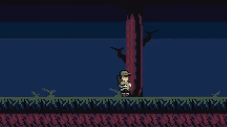
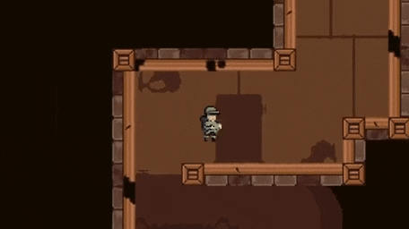

### Avocado ([GitHub](https://github.com/Hulvdan/Avocado))

Various studies applied to a platformer game in Unity, C#.

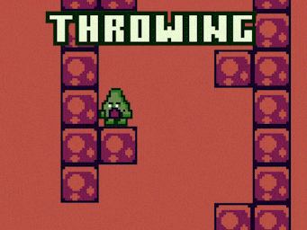
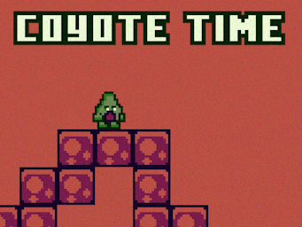

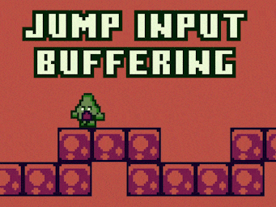
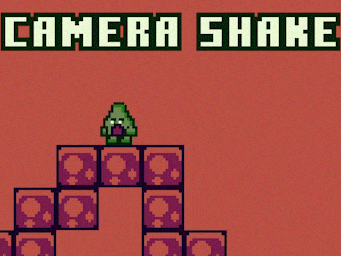

### Other small prototypes include:

- Isometric Minecraft
- Angry Birds
- Top-down tank
- Sea Battle with multiplayer
- Pong, Tetris, Chess, Sokoban, Arcanoid, Labyrinths, 2048, etc...
- Scripts: lots of macroses, a bit of memory manipulation
- A bit more other small prototypes

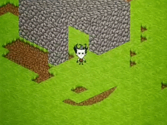
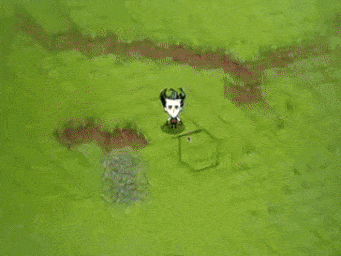
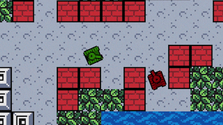
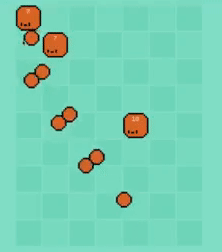
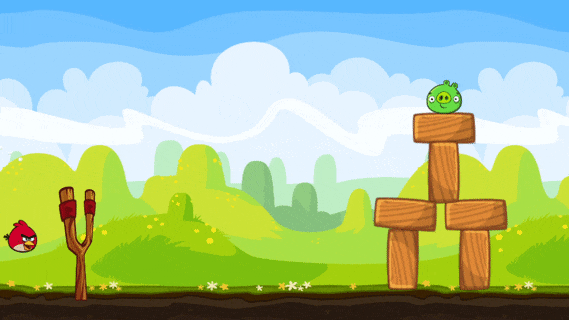

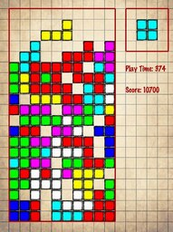
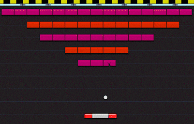

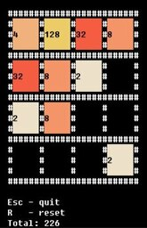
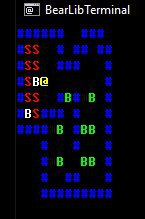
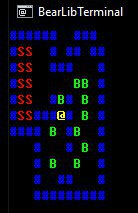

## Tools I worked on:

### [Dark Souls 3 Cheat Sheet tool](https://www.reddit.com/r/darksouls3/comments/7ylfqp/dark_souls_3_cheat_sheet_tool/)

A tool for tracking progress in Dark Souls 3.

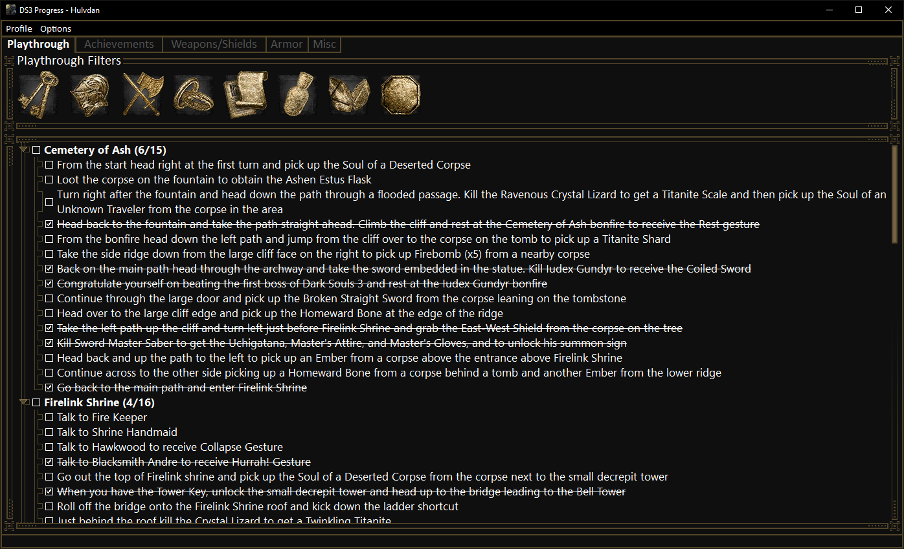

## Other Stuff:

### Monster Hunter: World Printable Monsters Weaknesses Booklet

Generated using Python, this is a set of images/documents for printing that shows weaknesses of monsters.

- [Reddit post](https://www.reddit.com/r/MonsterHunterWorld/comments/98avyb/mhw_printable_monsters_weaknesses_guide/)
- [Following Reddit post after a big game expansion release](https://www.reddit.com/r/MonsterHunterWorld/comments/njj57i/mhw_printable_monsters_weaknesses_guide_updated/)

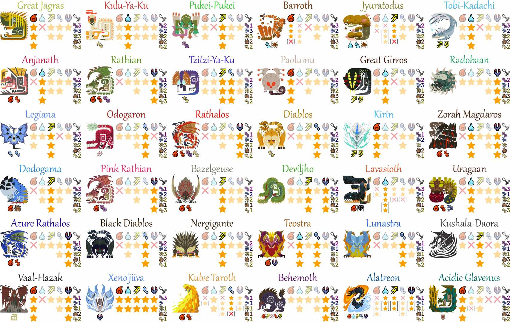

## Credited Work:

- [Vanilla Tweaks](https://forums.terraria.org/index.php?threads/vanilla-tweaks-other-little-tweak-mods.37443/#VanillaTweaks) mod for Terraria by gardenapple - Provided the Extractinator speed up code
- [Run on Save](https://marketplace.visualstudio.com/items/pucelle.run-on-save/changelog) VS Code extension by pucelle - Running VS Code's commands on save
