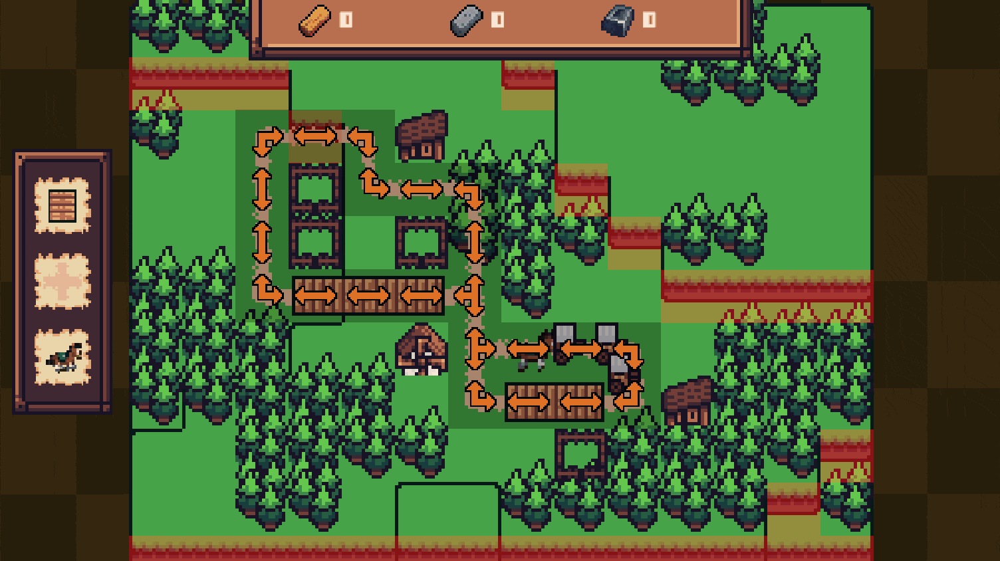
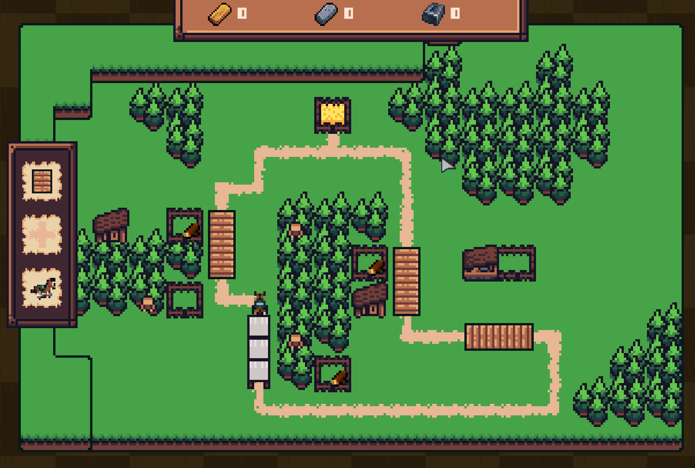
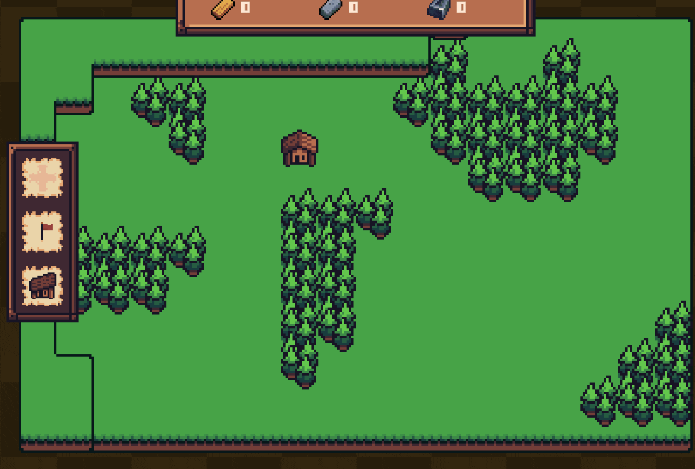
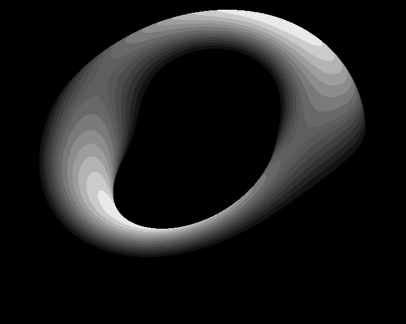

# Алексей Чистов

    <a href="mailto:agechistov@gmail.com">agechistov@gmail.com</a>
    |
    <a href="https://www.linkedin.com/in/agechistov">linkedin.com/in/agechistov</a>
    |
    Discord: hulvdan

> 
Web-site's version in [ENGLISH 🇬🇧](/docs/en.html)

Я Python Backend разработчик. В качестве одного из своих хобби я занимаюсь gamedev проектами. Здесь я собрал о них информацию.

## GameDev проекты, над которыми я работал:

### Roads of Horses - [C# Source](https://github.com/Hulvdan/RoadsOfHorses), [C++ Port Source](https://github.com/Hulvdan/handmade-cpp-game) (начиная с 10/2023 - н.в.)



Видеоигра, разрабатывать которую я начал на [Unity, C#](https://github.com/Hulvdan/RoadsOfHorses). Сейчас портирую на [C++](https://github.com/Hulvdan/handmade-cpp-game).
Вдохновленный «[Handmade Hero](https://handmadehero.org/faq)», я укрепляю навыки программирования, изучая работу CPU, работу с памятью, рендеринг, аудио, ASM и др.

 

Из интересного *<u>в техническом</u>* плане:

- На C++ я пишу код в основном «от руки», не используя какие-либо фреймворки вроде GLFW / SDL, с целью как можно лучше изучить различные аспекты языка и научиться разрабатывать комплексные вещи.
- Ручная работа с памятью.
- Горячая перезагрузка C++ кода с сохранением состояния при перезагрузках. Я слышал, что при разработке игр очень важно сохранять как можно меньшую длительность итераций.
- По той же причине собираю проект через один юнит трансляции (single translation unit build, unity build).
- Не пытаюсь всё оборачивать в шаблоны, классы и фанатично разделять функции по принципам «Чистого Кода». Сохраняю код максимально простым и прямолинейным.
- Использую clang-tidy и clang-format для сохранения качества и консистентности кода на уровне. Всё же у меня нет коммерческого опыта разработки на C++, поэтому мне очень важно иметь дополнительный «взгляд со стороны».

### 3D Пончик (2024)

Это я закреплял основы 3D, матричных трансформаций, линейной алгебры и программирования на C++ без использования библиотек.

### The Clocktower Letter – [itch.io](https://hulvdan.itch.io/the-clockwork-letter) (2023)

Короткая игра платформер для Metroidvania 21 game jam. Я был программистом в распределённой команде из 4-х человек.

### Другие небольшие поделки: (2016-2023)

Avocado - [GitHub](https://github.com/Hulvdan/Avocado). Некоторые фишки, применённые к платформеру на Unity, C#.

## Инструменты, над которыми я работал:

### Dark Souls 3 Cheat Sheet tool – [Reddit](https://www.reddit.com/r/darksouls3/comments/7ylfqp/dark_souls_3_cheat_sheet_tool/) (2018)

Программа для ручного отслеживания прогресса в Dark Souls 3 (Python, PyQt)

## Другое

### Monster Hunter: World Printable Monsters Weaknesses Booklet – [Reddit post](https://www.reddit.com/r/MonsterHunterWorld/comments/98avyb/mhw_printable_monsters_weaknesses_guide/), [Updated Reddit post](https://www.reddit.com/r/MonsterHunterWorld/comments/njj57i/mhw_printable_monsters_weaknesses_guide_updated/) (2018, 2021)

Набор изображений/документов для печати, что отображает уязвимости монстров в игре (Python, Pillow)

## Credited Work

- [Vanilla Tweaks](https://forums.terraria.org/index.php?threads/vanilla-tweaks-other-little-tweak-mods.37443/#VanillaTweaks) мод для Terraria от gardenapple - Поделился кодом для ускорения Extractinator-а (C#) (2017)
- [Run on Save](https://marketplace.visualstudio.com/items/pucelle.run-on-save/changelog) расширение VS Code от pucelle - Исполнение команд VS Code-а при сохранении файлов (TypeScript) (2020)

## Абсолютно Нерелевантно

Респект

- [Jonathan Blow](https://en.wikipedia.org/wiki/Jonathan_Blow) за его презентации языка программирования [JAI](https://youtube.com/playlist?list=PLmV5I2fxaiCKfxMBrNsU1kgKJXD3PkyxO&si=rX9v9mQwUJyd85x0), где он также рассматривает проблемы программирования и того, что с этим можно делать
- [Casey Muratori](https://caseymuratori.com/about) за его образовательные материалы [Performance-Aware Programming](https://youtube.com/playlist?list=PLEMXAbCVnmY7t29i_rd3mnALWu-aZr_42&si=e5JxZOPkl09MQK6x) и [Handmade Hero](https://handmadehero.org/faq)

 

> 
Сие есть моя страница, называемая «GameDev Портфолио». Называть её «Моя страница», будет, вероятно, правильнее.

    (Обновлено )

