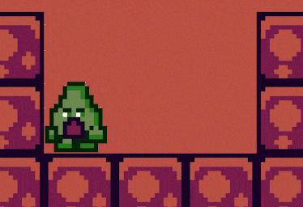

# Hulvdan

[itch.io](https://itch.io/profile/hulvdan) | [linktr.ee/hulvdan](https://linktr.ee/hulvdan)

Ahh, well met, Ashen One 👋

As a programmer, I'm looking to participate in game jams with teams of like-minded people. My goal is to start making games commercially once I've met the field's inspiring individuals and gained more experience.

Even though I started to program a way earlier, commercially speaking, I have been programming for 3.5+ years as a Python backend developer (HTTP, websockets, Nginx, PostgreSQL, admin panels, a bit of payments, a bit of hosting and configuration, Docker, CI/CD).

## My contacts:

- Discord: hulvdan

## In terms of GameDev, I worked on:

- A game in a team for Metroidvania 21 game jam - [The Clocktower Letter](https://hulvdan.itch.io/the-clockwork-letter)
- Isometric Minecraft
- Angry Birds
- Top-down tank
- Sea Battle with multiplayer
- Pong, Tetris, Chess, Sokoban, Arcanoid, Labyrinths, 2048, etc...
- Scripts: lots of macroses, a bit of memory manipulation
- A bit more other small prototypes

## I worked with:

- Unity, C#
- C++ with cocos2d, entt, box2d, some terminal graphics libraries
- 3D Meshes real-time creation in code
- Shaders - I experimented with 1) shaders written in HLSL and 2) Unity's Shader Graph. I've never touched the rendering pipeline, though
- 2D animations, Timeline
- Unity's InputManager, InputSystem
- Behavior Trees ([Behavior Designer](https://assetstore.unity.com/packages/tools/visual-scripting/behavior-designer-behavior-trees-for-everyone-15277))
- Tilemaps
- Texture atlases ([Texture Packer](https://www.codeandweb.com/texturepacker), [Free texture packer](http://free-tex-packer.com/))
- Music and sounds (a bit of [Wwise](https://www.audiokinetic.com/fr/products/wwise/), [FMOD](https://www.fmod.com/))

## Some highlights of my personal projects:

Various studies applied to a platformer game in Unity, C# - <https://github.com/Hulvdan/Avocado>

